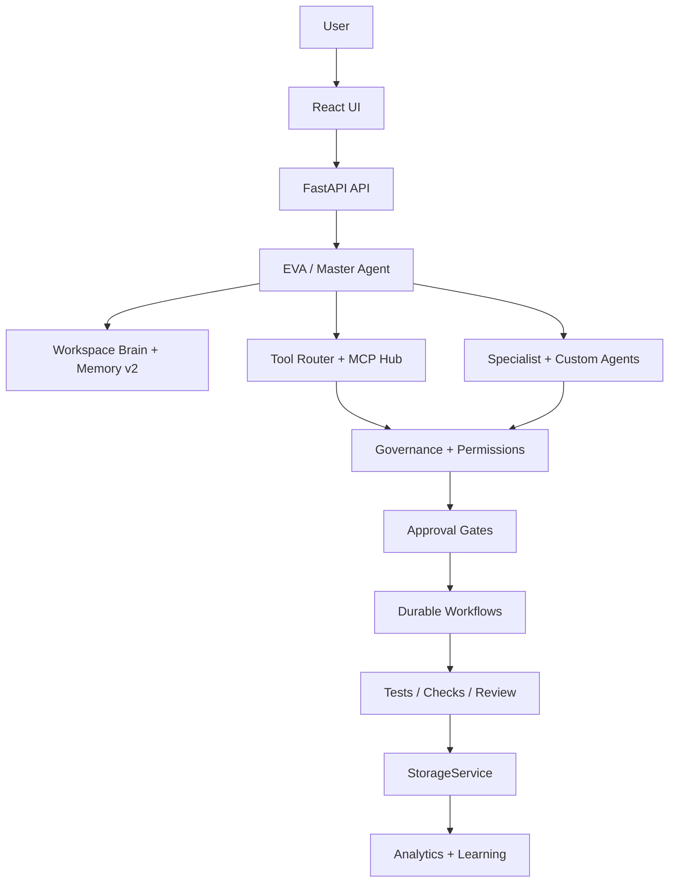

# EvolveAgent AI

Local-first, governance-first AI operating system for turning goals into planned, approved, verified work.

```text
Goal -> Plan -> Agents -> Tools -> Approval -> Execution -> Verification -> Memory -> Improvement
```

EvolveAgent is not trying to be a new foundation model. It is the operating layer around models like OpenAI, Claude, Gemini, Mistral, and local models. It manages context, agents, tools, permissions, workflows, verification, memory, and audit history so AI work can be repeatable and safer.

## Current Status

- **Platform:** EvolveAgent OS / v200 Command Center
- **Current work:** v220 Compute Fabric foundation
- **Backend:** FastAPI, 143 service modules, 87 split route modules, ~790 route handlers
- **Frontend:** React + Vite premium UI with Simple Mode and Developer Mode
- **Storage:** `StorageService` with JSON fallback, PostgreSQL/JSONB support, pgvector-ready Memory v2, optional Redis
- **Recent work:** Kaggle worker lifecycle cleanup and README/status simplification

## What It Does

- Routes user goals through EVA / Master Agent
- Uses workspace memory and project knowledge before answering
- Coordinates built-in and custom specialist agents
- Plans tool use through MCP-style connectors
- Requires approval for risky actions
- Tracks governance, permissions, secrets, and audit logs
- Supports durable workflows and code-change pipelines
- Records usage/cost estimates against workspace budgets
- Stores results back into memory and analytics
- Surfaces technical state in Developer Mode

## Core Features

- **Workspace Brain:** project memory, Memory v2 semantic recall, files, goals, and knowledge search
- **Mission Control:** goal planning, task graphs, phases, progress, and task execution state
- **Agent Registry:** custom agents, agent teams, departments, skills, versions, and evaluation data
- **Tool + MCP Hub:** connector planning, policy checks, approvals, audit, and replay
- **Governance:** permission profiles, prompt-injection checks, secret scanning, approval queues, and immutable logs
- **Autonomous Software Team:** approval-gated code-write, push, PR, and verification flow
- **Cost + Usage Ledger:** per-call usage estimates and workspace budget tracking
- **Compute Fabric:** worker registry plus opt-in Kaggle GPU worker foundation
- **Project/Business OS:** project manager, portfolio mode, business automation, simulations, and company brain
- **Developer Mode:** raw traces, provider metadata, storage status, Memory v2, worker state, approvals, and code-change state

## Architecture



## Tech Stack

**Backend**

- Python
- FastAPI
- Pydantic
- Uvicorn
- OpenAI / Anthropic / Gemini / Mistral SDK support
- PostgreSQL / JSONB / pgvector-ready memory
- Optional Redis
- JSON fallback storage

**Frontend**

- React
- Vite
- TypeScript/JavaScript
- Tailwind/CSS design system
- lucide-react
- Vitest

## Run Locally

Backend:

```bash
cd backend
python -m venv venv
source venv/bin/activate
pip install -r requirements.txt
uvicorn app.main:app --reload --port 8000
```

Frontend:

```bash
cd frontend
npm install
npm run dev -- --host 127.0.0.1 --port 5173
```

Open:

```text
http://127.0.0.1:5173
```

## Test

```bash
cd backend
python -m pytest -q
```

```bash
cd frontend
npm test
npm run build
```

Optional smoke test:

```bash
python scripts/smoke_test.py http://127.0.0.1:8000
```

## Environment

Mock/local mode works without API keys. Real providers are opt-in.

Common backend `.env` values:

```env
LLM_MODE=mock
DEFAULT_PROVIDER=mock
OPENAI_API_KEY=
ANTHROPIC_API_KEY=
GEMINI_API_KEY=
MISTRAL_API_KEY=
STORAGE_BACKEND=json
DATABASE_URL=
REDIS_URL=
```

Real integrations and compute adapters must be explicitly configured and remain approval-gated.

## Safety Model

EvolveAgent is designed to be useful without giving the AI unchecked power.

- No unrestricted shell execution
- No silent file edits
- No destructive file deletion
- No secret values shown in UI, logs, or API responses
- Risky actions require approval
- External sending/posting/payment/deployment is blocked or approval-gated
- Runtime data is excluded from Git
- The system does not self-train a base model
- The product is not AGI

## Important Docs

- [Project Architecture](docs/architecture/Project-Architecture.md)
- [v200 Strategy](docs/roadmap/EvolveAgent-v200-Strategy.md)
- [Route/Page Coverage Audit](docs/architecture/Route-Page-Coverage-Audit.md)
- [Codex Handoff](docs/CODEX_HANDOFF.md)
- [Portfolio Pack](docs/PORTFOLIO_PACK.md)
- [Version History](VERSIONS.md)
- [Demo Guide](DEMO.md)
- [Final Checklist](FINAL_CHECKLIST.md)

## Positioning

Claude, OpenAI, Gemini, and local models are intelligence engines. EvolveAgent is the control plane that gives those models memory, tools, governance, workflows, verification, and long-running project context.

The goal is not better chat. The goal is safer completion of real work.
