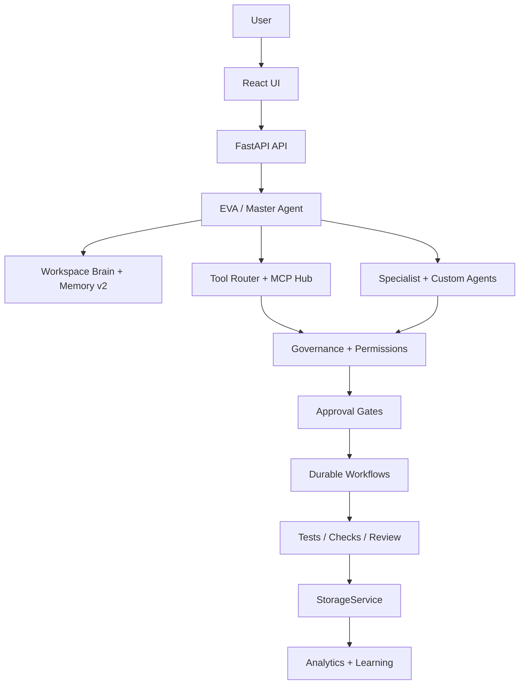

# EvolveAgent AI

Local-first, governance-first AI operating system for turning goals into planned, approved, verified work.

```text
Goal -> Plan -> Agents -> Tools -> Approval -> Execution -> Verification -> Memory -> Improvement
```

EvolveAgent is not trying to be a new foundation model. It is the operating layer around models like OpenAI, Claude, Gemini, Mistral, and local models. It manages context, agents, tools, permissions, workflows, verification, memory, and audit history so AI work can be repeatable and safer.

In simple terms: EvolveAgent is a project command center for AI work. A normal chatbot answers one prompt. EvolveAgent tries to understand the larger goal, break it into tasks, choose the right agents/tools, ask for approval when something is risky, verify the result, and remember what happened for the next run.

## Current Status

- **Platform:** EvolveAgent OS / v200 Command Center
- **Current work:** v220 Compute Fabric foundation
- **Backend:** FastAPI, 143 service modules, 87 split route modules, ~790 route handlers
- **Frontend:** React + Vite premium UI with Simple Mode and Developer Mode
- **Storage:** `StorageService` with JSON fallback, PostgreSQL/JSONB support, pgvector-ready Memory v2, optional Redis
- **Recent work:** Kaggle worker lifecycle cleanup and README/status simplification

## What It Does

- Routes user goals through EVA / Master Agent
- Uses workspace memory and project knowledge before answering
- Coordinates built-in and custom specialist agents
- Plans tool use through MCP-style connectors
- Requires approval for risky actions
- Tracks governance, permissions, secrets, and audit logs
- Supports durable workflows and code-change pipelines
- Records usage/cost estimates against workspace budgets
- Stores results back into memory and analytics
- Surfaces technical state in Developer Mode

## How a Request Works

1. The user submits a request through chat, voice, file upload, workflow, or Developer Mode.
2. EVA / Master Agent classifies the request and picks the safest route.
3. Workspace Brain loads relevant memory, files, goals, and project context.
4. The system selects specialist agents, custom agents, tools, or workflows.
5. Governance checks run: permissions, prompt-injection checks, secret scanning, and risk scoring.
6. If the request is risky, EvolveAgent creates an approval item instead of silently acting.
7. Approved actions run through safe services, durable workflows, or connector adapters.
8. Results are verified through tests, checks, scoring, or review flows where available.
9. Memory, analytics, usage/cost, and governance logs are updated.
10. The user gets a clean answer in Simple Mode or full traces in Developer Mode.

This makes the product closer to an AI operating workflow than a single chat box.

## Core Features

- **Workspace Brain:** project memory, Memory v2 semantic recall, files, goals, and knowledge search
- **Mission Control:** goal planning, task graphs, phases, progress, and task execution state
- **Agent Registry:** custom agents, agent teams, departments, skills, versions, and evaluation data
- **Tool + MCP Hub:** connector planning, policy checks, approvals, audit, and replay
- **Governance:** permission profiles, prompt-injection checks, secret scanning, approval queues, and immutable logs
- **Autonomous Software Team:** approval-gated code-write, push, PR, and verification flow
- **Cost + Usage Ledger:** per-call usage estimates and workspace budget tracking
- **Compute Fabric:** worker registry plus opt-in Kaggle GPU worker foundation
- **Project/Business OS:** project manager, portfolio mode, business automation, simulations, and company brain
- **Developer Mode:** raw traces, provider metadata, storage status, Memory v2, worker state, approvals, and code-change state

## Major Subsystems

### EVA / Master Agent

EVA is the top-level router. It decides whether a request is chat, research, code work, document analysis, workflow planning, tool usage, memory retrieval, or a higher-level operating-system task. It is designed to use the best available model/provider without locking the whole product to one vendor.

### Workspace Brain + Memory v2

The memory layer stores project facts, user preferences, decisions, task results, and workflow history. Memory v2 adds semantic recall through a pgvector-ready path with keyword fallback, so the system can pull useful context from previous work without forcing everything into one prompt.

### Mission Control

Mission Control turns bigger goals into task graphs. It tracks phases, subtasks, progress, priorities, blockers, and recommended agents. This is where a goal like "build a resume analyzer" becomes a structured plan rather than a single response.

### Agent Registry

Agents are reusable specialists with roles, prompts, tools, permissions, versions, and performance history. The registry supports built-in agents, custom agents, departments, agent teams, and marketplace-style skill packs.

### Tool + MCP Hub

The tool layer plans connector usage for GitHub, Linear, filesystem, Git, Slack, Notion, and other MCP-style tools. It is intentionally governed: connectors have risk levels, policies, approvals, audit logs, and read-only or mock-safe defaults.

### Governance + Approvals

Governance is the core safety layer. It checks prompt injection, secret exposure, permission rules, approval requirements, blocked actions, and audit logging. Risky actions such as editing files, pushing code, sending external messages, deleting data, or running commands must go through approval gates.

### Autonomous Software Team

The code-change pipeline can plan and stage software work through approval-gated steps: propose changes, show diffs, write files only after approval, run checks, push a branch, and prepare PR status. It is designed around verification, not blind autonomy.

### Compute Fabric

The v220 foundation introduces worker registration and opt-in compute adapters such as the Kaggle GPU worker. This is the start of a future distributed execution layer where EVA can route approved jobs to workers with tracked lifecycle, status, and analytics.

### Developer Mode

Developer Mode exposes what the system is doing: routing decisions, provider metadata, workflow traces, tool traces, storage status, Memory v2 details, approvals, governance logs, worker status, and code-change state. Simple Mode stays clean for everyday use.

## Architecture



## Tech Stack

**Backend**

- Python
- FastAPI
- Pydantic
- Uvicorn
- OpenAI / Anthropic / Gemini / Mistral SDK support
- PostgreSQL / JSONB / pgvector-ready memory
- Optional Redis
- JSON fallback storage

**Frontend**

- React
- Vite
- TypeScript/JavaScript
- Tailwind/CSS design system
- lucide-react
- Vitest

## Run Locally

Backend:

```bash
cd backend
python -m venv venv
source venv/bin/activate
pip install -r requirements.txt
uvicorn app.main:app --reload --port 8000
```

Frontend:

```bash
cd frontend
npm install
npm run dev -- --host 127.0.0.1 --port 5173
```

Open:

```text
http://127.0.0.1:5173
```

## Suggested Demo Flow

1. Start in **Simple Mode** and ask: "Explain how EvolveAgent works."
2. Switch to **Developer Mode** to inspect routing, agents, memory, and governance metadata.
3. Open **Project Brain** and add/search a memory item.
4. Open **Mission Control** and create a goal such as "Build an AI resume analyzer."
5. Open **Approvals** to see how risky actions are held before execution.
6. Open **Code Changes** to inspect the approval-gated software-team workflow.
7. Open **Command Center** to view the platform capability map and readiness score.

Good demo prompts:

- "Build an AI resume analyzer app."
- "Summarize this uploaded document."
- "Review this code and suggest tests."
- "Create a task plan for launching a SaaS product."
- "Find what this workspace already knows about my project."

## Test

```bash
cd backend
python -m pytest -q
```

```bash
cd frontend
npm test
npm run build
```

Optional smoke test:

```bash
python scripts/smoke_test.py http://127.0.0.1:8000
```

## Environment

Mock/local mode works without API keys. Real providers are opt-in.

Common backend `.env` values:

```env
LLM_MODE=mock
DEFAULT_PROVIDER=mock
OPENAI_API_KEY=
ANTHROPIC_API_KEY=
GEMINI_API_KEY=
MISTRAL_API_KEY=
STORAGE_BACKEND=json
DATABASE_URL=
REDIS_URL=
```

Real integrations and compute adapters must be explicitly configured and remain approval-gated.

## Safety Model

EvolveAgent is designed to be useful without giving the AI unchecked power.

- No unrestricted shell execution
- No silent file edits
- No destructive file deletion
- No secret values shown in UI, logs, or API responses
- Risky actions require approval
- External sending/posting/payment/deployment is blocked or approval-gated
- Runtime data is excluded from Git
- The system does not self-train a base model
- The product is not AGI

## Important Docs

- [Project Architecture](docs/architecture/Project-Architecture.md)
- [v200 Strategy](docs/roadmap/EvolveAgent-v200-Strategy.md)
- [Route/Page Coverage Audit](docs/architecture/Route-Page-Coverage-Audit.md)
- [Codex Handoff](docs/CODEX_HANDOFF.md)
- [Portfolio Pack](docs/PORTFOLIO_PACK.md)
- [Version History](VERSIONS.md)
- [Demo Guide](DEMO.md)
- [Final Checklist](FINAL_CHECKLIST.md)

## Positioning

Claude, OpenAI, Gemini, and local models are intelligence engines. EvolveAgent is the control plane that gives those models memory, tools, governance, workflows, verification, and long-running project context.

The goal is not better chat. The goal is safer completion of real work.
