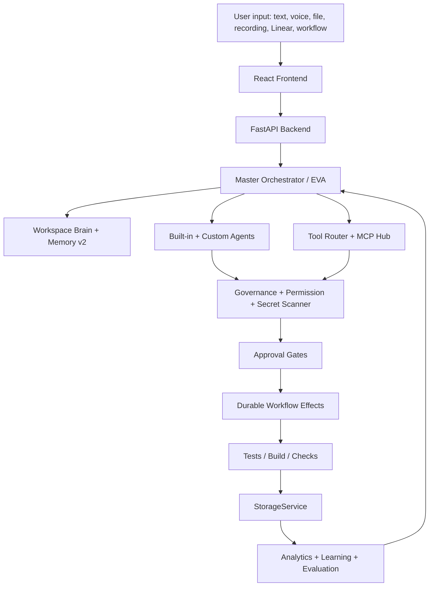
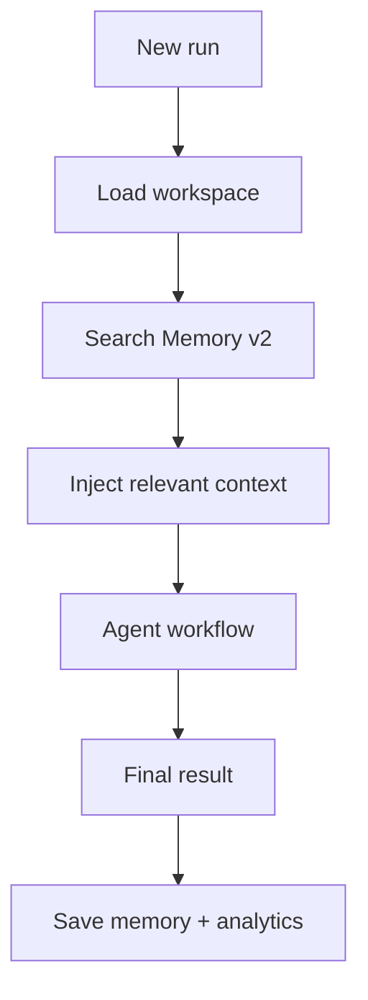
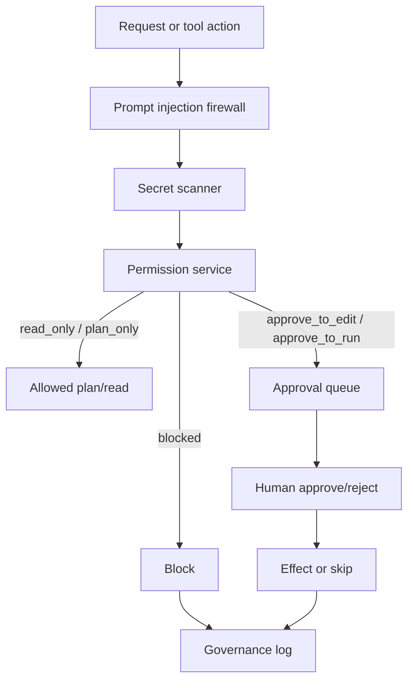
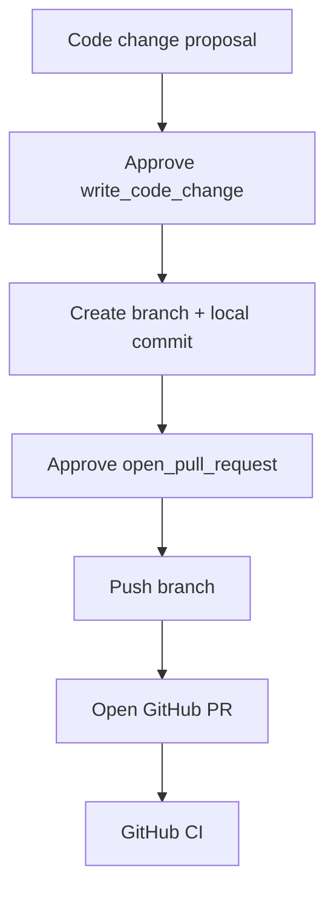

# EvolveAgent Project Architecture

## System Purpose
EvolveAgent AI is a local-first, governance-first AI operating system for planning, executing, verifying, remembering, and improving work across projects.

Core loop:

```text
Goal -> Plan -> Agents -> Tools -> Approval -> Execution -> Verification -> Memory -> Improvement
```

## High-Level Architecture



## Frontend

Main app:
- `frontend/src/App.tsx`
- `frontend/src/components/layout/Sidebar.tsx`
- `frontend/src/components/layout/TopBar.tsx`
- `frontend/src/data/api.ts`

Key pages:
- Home Dashboard
- Simple Mode Chat
- Dev Mode Console
- Mission Control
- Code Changes
- Approvals
- Project Brain
- Tools / MCP Hub
- Governance
- Settings

Frontend rule:
- Simple Mode stays clean.
- Developer Mode shows traces, raw metadata, approvals, storage, governance, and tool state.

## Backend

Main stack:
- FastAPI app
- Split route modules in `backend/app/api/`
- Service layer in `backend/app/services/`
- Pydantic request/response models in `backend/app/models/`
- Storage through `StorageService`

Backend pattern:

```text
Route -> Service -> StorageService -> GovernanceService -> JSON/Postgres backend
```

Important services:
- `master_agent_service.py`
- `durable_workflow_service.py`
- `governance_service.py`
- `permission_service.py`
- `memory_v2_service.py`
- `agent_registry_service.py`
- `mcp_connector_service.py`
- `github_connector_service.py`
- `code_writer_service.py`

## Storage

Storage design:
- All persistence goes through `StorageService`.
- JSON remains fallback.
- Postgres/pgvector foundation exists for v100+ real memory.
- Redis cache is optional and fail-open.

Storage rule:
- Services should not read/write runtime files directly.
- Runtime data stays out of Git.

## Memory + Workspace Brain

Memory flow:



Workspace Brain pulls context from:
- workspace metadata
- goals
- uploaded files
- custom agents
- memory entries

## Governance

Governance flow:



Hard safety rules:
- no unrestricted shell
- no silent file edits
- no secret exposure
- no external write without approval
- no destructive autonomous operations
- declined safely is valid outcome

## Durable Workflows

Durable workflows are the execution backbone.

They support:
- planned steps
- approval-gated steps
- real local effects
- audit trail
- multi-step approval
- resumable runs

Current v150 code-writing pipeline:



## Tool + MCP Layer

Tool execution rules:
- tools are registered
- permission level checked
- risky tools require approval
- real connectors expose readiness booleans, not secrets
- MCP execution is approval-gated and logged

Key tool areas:
- MCP Connector Hub
- GitHub Connector
- Tool Router
- Code Writer
- Approval Center

## Agent Layer

Agent types:
- Master Orchestrator / EVA
- specialist agents
- custom agents
- department agents
- workforce marketplace agents
- code-writing agent

Agent rule:
- Agents can plan and recommend.
- Agents cannot bypass governance, permissions, or approval gates.

## Verification

Verification layers:
- backend tests
- frontend build
- GitHub CI
- smoke tests
- evaluation lab
- judge scoring

Standard commands:

```bash
cd backend && ./venv/bin/pytest -q
cd frontend && npm run build
```

## Architecture Boundaries

Keep:
- local-first
- mock-safe defaults
- approval-gated writes
- StorageService chokepoint
- governance logging
- Simple Mode clean
- Developer Mode transparent

Avoid:
- direct DB access from services
- raw secrets in UI/logs
- real sends/payments/deploys without approval
- committing runtime JSON
- bypassing branch protection

## Related Docs
- [[../ARCHITECTURE]]
- [[../CODEX_HANDOFF]]
- [[../CODEX_ASSIGNMENT_v100]]
- [[../CODEX_ASSIGNMENT_v150_frontend]]
- [[../obsidian/EvolveAgent-Index]]
